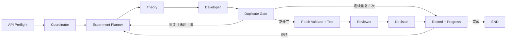

# 需求2：壳单元刚度矩阵多 Agent 工作流

## 项目介绍

本项目以四节点 Abaqus S4 壳单元为主对齐对象，通过多 Agent 协作完成基准数据生成、理论分析、C++ 刚度矩阵实现、Catch2 测试和误差评审。

最终目标：根据节点坐标、材料参数和壳厚，使用 C++ 生成 `24 x 24` 单元刚度矩阵，并使其与 Abaqus S4 基准矩阵的主误差指标小于 `1%`。

### 多 Agent 工作流



| 阶段 | 类型 | 当前职责 |
| --- | --- | --- |
| API Preflight | 在线工具节点 | 验证密钥、网关、模型和接口 |
| Coordinator | 本地工具节点 | 建立共享状态、基线和运行目录 |
| Experiment Planner | 在线 LLM 节点 | 检查实验记忆，选择本轮唯一实验类别和修改边界 |
| Theory | 在线 LLM 节点 | 围绕 Planner 计划完成理论论证 |
| Developer | 在线 LLM 节点 | 根据计划和理论结论生成受限 C++ 补丁 |
| Duplicate Gate | 本地工具节点 | 计算补丁语义指纹，拦截当前运行及跨运行重复实验 |
| Patch Validate + Test | 本地工具节点 | 校验补丁、编译、运行 Catch2 并与 Abaqus 矩阵比较 |
| Reviewer | 在线 LLM 节点 | 根据真实测试结果给出 `accept/reject` 评审建议 |
| Decision | 本地工具节点 | 检测误差是否下降，下降时接受重新应用并复验补丁 |
| Record + Progress | 本地工具节点 | 持久化实验、checkpoint 和进度 |

### Run 入口与代码位置

用户启动命令：

```bash
python -m shell_agent run --max-iterations 3 --target-error 0.01
```

实际调用链：

```text
shell_agent/__main__.py
-> shell_agent/cli.py
-> scripts/graph.py::main()
-> build_graph()
-> graph.stream()
```

| 代码位置 | 职责 |
| --- | --- |
| `shell_agent/__main__.py` | `python -m shell_agent` 的 Python 模块入口 |
| `shell_agent/cli.py` | 解析 `run`、`resume`、`verify`、`api-check` 及参数 |
| `scripts/graph.py` | 定义 `GraphState`、Node、Edge、条件路由、checkpoint 和执行循环 |
| `scripts/agents.py` | 实现 Planner、Theory、Developer、Reviewer 调用，组装上下文并处理补丁、验证和实验记忆 |
| `scripts/agent_openai_client.py` | 读取 `.env`，调用 Responses 或 Chat Completions 兼容 API |
| `shell_agent/verification.py` | 编译 C++、运行 `24 x 24` 矩阵计算和 Catch2 |

Node 和 Edge 统一在 `scripts/graph.py` 的 `build_graph()` 中设置：

```python
graph = StateGraph(GraphState)
graph.add_node("planner", planner_node)
graph.add_edge("planner", "theory")
graph.add_conditional_edges("duplicate_gate", route_after_duplicate_gate, {...})
```

- `add_node()`：注册工作节点及对应 Python 函数。
- `add_edge()`：设置无条件的固定执行顺序。
- `add_conditional_edges()`：设置误差目标、重复补丁和迭代次数等判断分支。
- `GraphState`：保存当前误差、实验计划、Agent 输出、Reviewer 反馈和运行状态。
- `graph.stream()`：正式启动图，逐节点执行并输出进度。

## 执行指南

### 环境要求

- Python 3.10 或更高版本。
- 支持 C++17 的编译器。
- 在线 Agent 需要 OpenAI API 或兼容网关。
- 重新生成基准矩阵需要 Windows PC 上的 Abaqus。

本地 C++ 数值验证不依赖第三方 Python 包，测试使用项目内置的 Catch2 单文件版本。LangGraph 在线编排需要安装单独依赖。

### 安装 LangGraph

在 Python 3.10 或更高版本的 Conda 环境中执行：

```bash
python -m pip install -r requirements-langgraph.txt
```

当前 Mac 的 Conda base 已安装并验证 `langgraph 1.2.9` 和 `langgraph-checkpoint-sqlite 3.1.0`。

安装后可执行不联网检查：

```bash
python -m shell_agent check
```

开始在线工作流前检查真实 API、模型和网关：

```bash
python -m shell_agent api-check
```

`api-check` 会发送一次最小真实请求，因此会产生很少量的 API 用量。正式 `run` 也会先执行同样的 API Preflight 节点；失败时保留 checkpoint，不会开始数值迭代。

### 配置在线 API

```bash
cp .env.example .env
```

```text
OPENAI_API_KEY=你的密钥
OPENAI_MODEL=gpt-5.5
OPENAI_BASE_URL=https://api.openai.com/v1
OPENAI_API_STYLE=auto
OPENAI_TIMEOUT_SECONDS=90
OPENAI_MAX_RETRIES=2
OPENAI_MAX_OUTPUT_TOKENS=1800
OPENAI_REASONING_EFFORT=low
```

`.env` 已加入 `.gitignore`。不得把真实密钥写入代码、提示词、README、日志或截图。

`OPENAI_API_STYLE=auto` 会优先调用 `/responses`，404 时在线回退到 `/chat/completions`；这不是离线模式。

### 推荐执行流程

在项目根目录依次执行：

1. 验证当前 C++ 基线：

```bash
python -m shell_agent verify
```

批量验证训练集和测试集：

```bash
python -m shell_agent verify-dataset
```

最终验收时要求测试集至少包含一个独立 Abaqus 基准：

```bash
python -m shell_agent verify-dataset --require-test
```

数据集划分位于 `data/datasets/shell_stiffness.json`。训练集用于迭代诊断，测试集用于泛化检查；同一样本禁止同时出现在两个集合中。

2. 检查真实 API：

```bash
python -m shell_agent api-check
```

3. 启动正式在线多 Agent 迭代：

```bash
python -m shell_agent run --max-iterations 3 --target-error 0.01
```

默认使用 LangGraph。运行时终端会依次打印 Experiment Planner、Theory、Developer、Duplicate Gate、Test、Reviewer 和 `[checkpoint]` 进度。每轮只有在测试通过、误差真实下降且 Reviewer 建议接受时，本地 Decision 节点才会保留代码，否则保持上一有效版本。

4. 运行结束后查看最新摘要：

```bash
cat docs/verification/agent-latest.md
```

完整过程位于 `workflow/runs/run-时间戳/`，包括每个 Agent 的原始输出、补丁、测试日志、Reviewer 决策和 `state.json`。

5. 未达到 `0.01` 时，再次运行相同命令。新一批从上一次已接受的代码继续，而不是从最初版本重新开始。

新一批还会读取 `workflow/experiment-memory.json`。Experiment Planner 先选择本轮实验类别，Developer 生成补丁后由本地 Duplicate Gate 计算语义指纹；与历史失败实验重复的补丁不会进入编译，而是退回 Planner 重新规划。

### 恢复与兼容入口

API 或节点失败时，使用终端给出的 run ID 从 SQLite checkpoint 恢复：

```bash
python -m shell_agent resume run-时间戳
```

临时回退到原手写编排：

```bash
python -m shell_agent legacy --max-iterations 3 --target-error 0.01
```

### 退出码

- `0`：至少接受了一轮改进，或者已经达到目标。
- `2`：本批次没有候选改进被接受；代码已经回滚，通常不是程序故障。
- `3`：API 或节点暂时失败，SQLite checkpoint 已保存，可以执行终端给出的 `--resume` 命令。
- 其他异常：检查终端报错、`.env` 配置和本轮目录内的日志。

## 工程参考

### Abaqus S4 样本口径

| 项目 | 值 |
| --- | --- |
| 单元类型 | Abaqus S4 |
| 节点顺序 | `1-2-3-4` 逆时针 |
| 每节点自由度 | `x y z rx ry rz` |
| 总自由度 | 24 |
| 几何 | XY 平面单位正方形 |
| 弹性模量 | `2.1e11` |
| 泊松比 | `0.3` |
| 厚度 | `0.01` |

Windows PC 导出链路：

```text
sample_001_s4_matrix_export.inp
-> Abaqus MATRIX GENERATE
-> sample_001_s4_matrix_export_X1.sim
-> abaqus mtxasm text
-> sample_001_s4_matrix_export_X1_STIF-1.mtx
-> convert_abaqus_mtx_to_csv.py
-> sample_001_abaqus_s4.csv
```

详细说明见 `docs/abaqus/export-s4-stiffness.md`。

### C++ 核心接口

```cpp
ShellElementInput readShellElementInput(const std::filesystem::path& path);
ShellStiffnessComponents computeShellElementStiffnessComponents(const ShellElementInput& input);
Matrix24 computeShellElementStiffness(const ShellElementInput& input);
MatrixError compareMatrix(const Matrix24& actual, const Matrix24& expected);
```

`ShellStiffnessComponents` 分别提供 `membrane`、`bending`、`shear`、`drilling` 和 `total`，用于分块误差诊断。

误差指标：

- `frobeniusRelative`：当前主进度和建议主验收指标。
- `maxAbsolute`：最大绝对误差。
- `maxRelativeEntry`：逐项相对误差；Abaqus 接近零的条目会将其显著放大。
- `symmetryError`：矩阵对称性误差。

最终 `1%` 口径仍需确认是只约束 Frobenius，还是同时约束有意义非零项的逐项误差。

### 目录结构

```text
.
├── agents/                 Agent 提示词与角色配置
├── build/                  本地编译产物
├── data/                   Abaqus 基准、元数据和 C++ 输出
├── docs/                   需求、Agent、Abaqus 和验证文档
├── include/shell/          C++ 公共接口
├── scripts/                `graph.py`、`agents.py`、API 客户端和 Abaqus 工具
├── shell_agent/            统一 Python CLI 与 C++ 验证驱动
├── src/shell/              C++ 壳单元实现
├── tests/                  Catch2 与 API 客户端测试
├── workflow/               Agent 共享状态、checkpoint 和运行产物
├── 参考资料/               理论文献、Shell203 和 AbaqusAgent 示例
├── CMakeLists.txt          CMake 构建入口
├── requirements-langgraph.txt  LangGraph 在线编排依赖
└── README.md               项目入口和使用说明
```

### 关键输出

| 输出 | 路径 |
| --- | --- |
| Abaqus 基准矩阵 | `data/abaqus/matrix/sample_001_abaqus_s4.csv` |
| C++ 输出矩阵 | `data/cpp/sample_001_cpp.csv` |
| 当前验证报告 | `docs/verification/sample-001-report.md` |
| 项目进度日志 | `docs/verification/progress-log.md` |
| 项目状态与下一步 | `docs/PROJECT_PROGRESS.md` |
| 跨运行实验记忆 | `workflow/experiment-memory.json` |
| 历史运行目录说明 | `workflow/runs/README.md` |

## 安全与维护

- 不提交 `.env`、API Key、令牌和账号信息。
- 不修改 `tests/infra/` 的第三方 Catch2 源码，除非明确升级依赖。
- `build/`、`__pycache__/`、`.idea/` 和系统缓存是本地生成物，不作为核心源码。
- `workflow/runs/` 中的运行日志属于实验审计材料，虽然由程序生成，但应按需保留。
- 替换 Abaqus 基准矩阵时，必须同步更新对应元数据和导出记录。
- 参考 Shell203/SHELL181 时必须说明它们只是实现参考；Abaqus S4 是当前主验收基准。

## 当前进度与快照

前期流程验证和真实 Agent 接入已经完成，当前正式工作流正在进行 Abaqus S4 数值对齐。

| 项目 | 当前状态 |
| --- | --- |
| 默认在线模型 | `gpt-5.5` |
| 最新完成运行 | `stage3-lg-20260724-133115` |
| 初始 Frobenius 相对误差 | `0.142174` |
| 当前 Frobenius 相对误差 | `0.0595967`，约 `5.95967%` |
| 已接受迭代 | `3` |
| C++/Catch2 | `43 assertions in 6 test cases` 全部通过 |
| 最终目标 | Frobenius 相对误差小于 `1%` |

最新一批的误差变化：

```text
0.142174
-> 0.0813914  膜内 assumed-strain 投影
-> 0.0683817  横向剪切有效刚度调整
-> 0.0595967  横向剪切 2 x 2 积分
```

当前保留上述三项已接受修改。下一步聚焦剩余 `bending_shear` 与 `uz-rx/ry` 耦合误差，先压到 `5%`，再逐级压到 `2%` 和 `1%`；单样本达标后扩展到斜平面、不同长宽比和扭曲四边形样本。

详细记录：

- [项目进度与下一步](docs/PROJECT_PROGRESS.md)
- [详细验证时间线](docs/verification/progress-log.md)
- [当前数值报告](docs/verification/sample-001-report.md)
- [最新多 Agent 运行报告](workflow/runs/stage3-lg-20260724-133115/summary.md)
