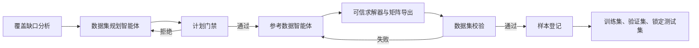
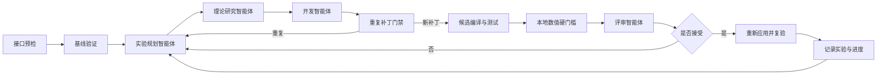

# 通用单元矩阵多智能体工作流

## 项目目标

本项目提供配置驱动的单元矩阵数值对齐流程。单元类型、方阵尺寸、自由度分组、数据集、数值适配器和 Agent 可修改源码都由 `stiffness_agent/config/project.json` 声明；公共层负责数据治理、误差比较、候选门禁、回退和多智能体编排。

仓库当前配置仍以 Abaqus S4 为首个内置适配器和示例项目。`sample_001` 的 Frobenius 相对误差为 `0.0410265`，约 `4.10265%`；这不是公共框架的 `24 x 24` 限制。

## 接入新单元

用户主要修改 `stiffness_agent/config/project.json` 中的：

- `element_type` 和 `matrix_dimensions`；
- `node_count`、`dof_labels_per_node` 和 `diagnostic_groups`；
- `dataset`、`primary_sample` 和 `adapter`；
- `agent.allowed_patch_paths` 与验收目标。

其他单元需要提供自己的矩阵计算程序，并在项目配置中写明怎样运行它；该配置的技术名称是 `command` 接入方式。先从 `docs/用户手册.md` 按任务选择快速开始、操作指南、参考或架构说明；可复制的配置见 `stiffness_agent/config/project.example.json`。

## 两个闭环

### 数据生成闭环



数据集采用三个互斥划分：

- `train`：agent 可以直接看详细的误差 可以根据训练集的样本 规划和修改代码；
- `validation`：只能看到总误差数值，防止只适配训练样本；
- `test`：最后的测试，判断是否通过

数据清单路径由项目配置的 `dataset` 指定。当前 S4 示例有 4 个真实 Abaqus 训练样本、1 个验证样本，测试集仍为空；开发验证不会读取 test，最终验收条件尚未满足。

### 数值优化闭环



开发智能体只能修改 `agent.allowed_patch_paths` 中声明的源码。候选补丁必须满足：

- Catch2 测试通过；
- 整体误差有实质下降；
- 规划指定的主分块改善；
- 对称性、最大绝对误差和非目标分块不越过本地门槛；
- 评审智能体建议接受；
- 接受后重新应用补丁的复验结果与候选结果一致。

## 环境要求

- Python 3.10 或更高版本；
- 当前项目适配器需要的编译器或运行时；
- 在线多智能体迭代需要 OpenAI 接口或兼容网关；
- 生成新参考矩阵需要可追溯的可信求解器；当前 S4 示例使用 Abaqus。

安装 LangGraph 依赖：

```bash
python -m pip install -r requirements.txt
```

检查本地编排环境，不调用在线接口：

```bash
python -m stiffness_agent check
```

## 常用命令

### 校验项目配置

```bash
python -m stiffness_agent validate-project
```

### 主样本与适配器测试

```bash
python -m stiffness_agent verify
```

默认报告：`docs/verification/样本001验证报告.md`。

### 重置并重新规划

```bash
python -m stiffness_agent reset-plan \
  --reason "切换为新的单元类型、矩阵尺寸或数据集"
python -m stiffness_agent replan
```

`reset-plan` 会归档旧活动记忆，不删除历史运行；`replan` 只运行基线和 Planner，不修改源码。

### 训练集、验证集和测试集批量验证

```bash
python -m stiffness_agent verify-dataset
```

最终严格验收要求验证集、测试集和测试锁全部就绪：

```bash
python -m stiffness_agent verify-dataset --require-test
```

### 校验数据生成计划

```bash
python -m stiffness_agent validate-data-plan \
  data/datasets/plans/example_train_batch.json
```

### 登记可信参考样本

```bash
python -m stiffness_agent register-sample \
  --meta data/my_element/metadata/sample_002.json \
  --split train
```

`--split` 可选 `train`、`validation` 或 `test`。登记测试样本时会重建测试集哈希锁。

### 检查测试集锁

```bash
python -m stiffness_agent check-test-lock
```

### 检查在线接口

```bash
cp .env.example .env
python -m stiffness_agent api-check
```

真实密钥只写入 `.env`，不能提交到 Git。

### 启动在线数值迭代

```bash
python -m stiffness_agent run --max-iterations 3
```

接口或节点失败后，可以从 SQLite 检查点恢复：

```bash
python -m stiffness_agent resume <运行编号>
```

## 数值指标

| 指标 | 含义 |
| --- | --- |
| `frobenius_relative_error` | 矩阵整体弗罗贝尼乌斯相对误差，当前主进度指标 |
| `max_absolute_error` | 单个矩阵条目的最大绝对误差 |
| `max_relative_entry_error` | 逐项最大相对误差，容易被参考矩阵中接近零的条目放大 |
| `symmetry_error` | 矩阵对称性误差 |
| `<group>__<group>` | 项目配置 `diagnostic_groups` 生成的分块相对误差 |

批量验证同时报告每个划分的平均整体误差、最差误差和最差样本。最终验收应以独立测试集最差误差为主要门槛，不能只看训练集平均值。

## 目录结构

```text
.
├── data/                   Abaqus 基准、样本元数据和数据集划分
├── docs/                   需求、理论、Abaqus 和验证文档
├── include/fem/s4/         C++ 公共接口
├── scripts/                图编排、智能体调用和 Abaqus 工具
├── stiffness_agent/        命令行、项目配置和智能体提示词
├── src/fem/s4/             C++ 壳单元实现
├── tests/                  C++ 与 Python 测试
├── CMakeLists.txt          CMake 构建入口
└── README.md               项目入口说明
```

## 关键文件

| 文件 | 用途 |
| --- | --- |
| `stiffness_agent/config/project.json` | 当前单元类型、矩阵尺寸、适配器和 Agent 边界 |
| `stiffness_agent/config/project.example.json` | 新单元配置示例 |
| `docs/用户手册.md` | 用户任务导航与标准操作主流程 |
| `docs/用户手册/` | 快速开始、新单元接入、参考、运行检查和架构说明 |
| `src/fem/s4/S4Stiffness.cpp` | 当前内置 S4 数值实现 |
| `tests/s4_stiffness_tests.cpp` | Catch2 物理与回归测试 |
| `data/datasets/s4_stiffness.json` | 三划分数据清单 |
| `data/datasets/test-lock.json` | 最终测试集哈希锁 |
| `stiffness_agent/dataset_plan.py` | 数据计划确定性门禁 |
| `stiffness_agent/dataset_registry.py` | 样本校验、登记和测试锁 |
| `stiffness_agent/project_config.py` | 通用项目配置校验 |
| `stiffness_agent/matrix_validation.py` | 任意尺寸方阵读取与公共误差计算 |
| `stiffness_agent/verification.py` | 内置与命令适配器协议 |
| `stiffness_agent/dataset_verification.py` | 三划分批量验证 |
| `scripts/langgraph_workflow.py` | LangGraph 节点和条件路由 |
| `scripts/agent_workflow.py` | 数值诊断、补丁门禁、智能体上下文和接受规则 |
| `build/workflow/experiment-memory.json` | 跨运行实验记忆 |

## 安全与维护

- 不提交 `.env`、密钥、令牌和账号信息；
- 不修改 `tests/infra/` 中的第三方 Catch2 源码，除非明确升级依赖；
- 不允许模型直接生成或修改可信参考矩阵；
- 新样本必须记录真实求解器或外部参考来源并通过登记门禁；
- 训练集、验证集和测试集不得重叠；
- 测试集生成后必须锁定哈希，任何变化都使最终验收失败；
- `build/`、Python 缓存和系统缓存都是可重新生成的本地产物；
- `build/workflow/runs/` 是历史审计记录，不参与代码版本控制。
