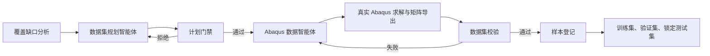
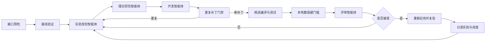

# 需求2：壳单元刚度矩阵多智能体工作流

## 项目目标

本项目以四节点 Abaqus S4 壳单元为主对齐对象，根据节点坐标、材料参数和壳厚，使用 C++ 生成 `24×24` 单元刚度矩阵，并通过真实 Abaqus 基准、Catch2 测试和多智能体迭代逐步降低误差。

当前 `sample_001` 的弗罗贝尼乌斯相对误差为 `0.0595967`，约 `5.95967%`；最终目标为小于 `1%`。单样本结果只用于开发，不代表最终泛化验收。

## 两个闭环

### 数据生成闭环



数据集采用三个互斥划分：

- `train`：提供详细诊断，供智能体规划和修改代码；
- `validation`：筛选候选补丁，防止只适配训练样本；
- `test`：哈希锁定后只用于一次性最终验收。

数据清单位于 `data/datasets/shell_stiffness.json`。当前只有一个真实 Abaqus 样本，放在训练集；验证集和测试集仍待补充。

### 数值优化闭环



开发智能体只能修改 `src/shell/ShellStiffness.cpp`。候选补丁必须满足：

- Catch2 测试通过；
- 整体误差有实质下降；
- 规划指定的主分块改善；
- 对称性、最大绝对误差和非目标分块不越过本地门槛；
- 评审智能体建议接受；
- 接受后重新应用补丁的复验结果与候选结果一致。

## 环境要求

- Python 3.10 或更高版本；
- 支持 C++17 的编译器；
- 在线多智能体迭代需要 OpenAI 接口或兼容网关；
- 生成新基准矩阵需要装有 Abaqus 和有效许可证的环境。

安装 LangGraph 依赖：

```bash
python -m pip install -r requirements-langgraph.txt
```

检查本地编排环境，不调用在线接口：

```bash
python -m shell_agent check
```

## 常用命令

### 单样本 C++ 与 Catch2 验证

```bash
python -m shell_agent verify
```

默认报告：`docs/verification/sample-001-report.md`。

### 训练集、验证集和测试集批量验证

```bash
python -m shell_agent verify-dataset
```

最终严格验收要求验证集、测试集和测试锁全部就绪：

```bash
python -m shell_agent verify-dataset --require-test
```

### 校验数据生成计划

```bash
python -m shell_agent validate-data-plan \
  data/datasets/plans/example_train_batch.json
```

### 登记真实 Abaqus 样本

```bash
python -m shell_agent register-sample \
  --meta data/abaqus/meta/sample_002.json \
  --split train
```

`--split` 可选 `train`、`validation` 或 `test`。登记测试样本时会重建测试集哈希锁。

### 检查测试集锁

```bash
python -m shell_agent check-test-lock
```

### 检查在线接口

```bash
cp .env.example .env
python -m shell_agent api-check
```

真实密钥只写入 `.env`，不能提交到 Git。

### 启动在线数值迭代

```bash
python -m shell_agent run --max-iterations 3 --target-error 0.01
```

接口或节点失败后，可以从 SQLite 检查点恢复：

```bash
python -m shell_agent resume <运行编号>
```

## 数值指标

| 指标 | 含义 |
| --- | --- |
| `frobenius_relative_error` | 矩阵整体弗罗贝尼乌斯相对误差，当前主进度指标 |
| `max_absolute_error` | 单个矩阵条目的最大绝对误差 |
| `max_relative_entry_error` | 逐项最大相对误差，容易被参考矩阵中接近零的条目放大 |
| `symmetry_error` | 矩阵对称性误差 |
| `membrane_xy__*` | 面内自由度相关分块误差 |
| `bending_shear__*` | 弯曲与横向剪切相关分块误差 |
| `drilling__*` | 钻转自由度相关分块误差 |

批量验证同时报告每个划分的平均整体误差、最差误差和最差样本。最终验收应以独立测试集最差误差为主要门槛，不能只看训练集平均值。

## 目录结构

```text
.
├── agents/                 智能体提示词与角色约束
├── data/                   Abaqus 基准、样本元数据和数据集划分
├── docs/                   需求、理论、Abaqus 和验证文档
├── include/shell/          C++ 公共接口
├── manual_catch2/          手动编译 Catch2 教程
├── scripts/                图编排、智能体调用和 Abaqus 工具
├── shell_agent/            统一 Python 命令行与验证驱动
├── src/shell/              C++ 壳单元实现
├── tests/                  C++ 与 Python 测试
├── workflow/               检查点、实验记忆和历史运行记录
├── CMakeLists.txt          CMake 构建入口
└── README.md               项目入口说明
```

## 关键文件

| 文件 | 用途 |
| --- | --- |
| `src/shell/ShellStiffness.cpp` | 当前壳单元刚度实现 |
| `tests/shell_stiffness_tests.cpp` | Catch2 物理与回归测试 |
| `data/datasets/shell_stiffness.json` | 三划分数据清单 |
| `data/datasets/test-lock.json` | 最终测试集哈希锁 |
| `shell_agent/dataset_plan.py` | 数据计划确定性门禁 |
| `shell_agent/dataset_registry.py` | 样本校验、登记和测试锁 |
| `shell_agent/dataset_verification.py` | 三划分批量验证 |
| `scripts/graph.py` | LangGraph 节点和条件路由 |
| `scripts/agents.py` | 数值诊断、补丁门禁、智能体上下文和接受规则 |
| `workflow/experiment-memory.json` | 跨运行实验记忆 |

## 安全与维护

- 不提交 `.env`、密钥、令牌和账号信息；
- 不修改 `tests/infra/` 中的第三方 Catch2 源码，除非明确升级依赖；
- 不允许模型直接生成或修改 Abaqus 参考矩阵；
- 新样本必须记录真实 Abaqus 来源并通过登记门禁；
- 训练集、验证集和测试集不得重叠；
- 测试集生成后必须锁定哈希，任何变化都使最终验收失败；
- `build/`、Python 缓存和系统缓存都是可重新生成的本地产物；
- `workflow/runs/` 是历史审计记录，不参与代码版本控制。
