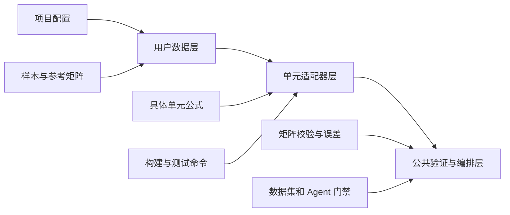

# 架构与协同

本页解释工作流为什么拆成项目配置、样本、适配器、数据集和多智能体，而不是把所有逻辑写进一个脚本。

## 三层结构



### 用户数据层

描述计算对象和可信基准，不包含多智能体的中间推理。换一个算例主要改这一层。

### 单元适配器层

负责把一个样本转换成实现矩阵。换一个单元公式主要改这一层。

### 公共验证与编排层

负责矩阵读取、统一指标、数据集隔离、候选门禁、回退和审计。它不应该知道梁、壳、实体单元的具体公式。

## 为什么需要适配器

不同单元的节点数、自由度、积分方案和实现语言都不同，但验证流程相同：

```text
样本 -> 实现矩阵 -> 参考矩阵比较 -> 测试 -> 报告
```

适配器把差异限制在一个边界内，使公共层可以支持不同尺寸的方阵，同时避免错误复用 S4 公式。

## 多智能体如何协同


| 角色 | 责任 | 不负责 |
| --- | --- | --- |
| Planner | 选择本轮唯一实验和目标矩阵块 | 不修改源码 |
| Theory | 分析有限元机理和可验证假设 | 不放宽验收门槛 |
| Developer | 只修改白名单源码 | 不修改可信参考矩阵和测试 |
| 本地门禁 | 编译、测试、计算误差和检查回归 | 不接受模型解释代替数值结果 |
| Reviewer | 结合证据接受或拒绝候选 | 不能绕过失败测试 |

## 为什么分 train、validation、test

- `train` 可以暴露详细诊断，供算法改进；
- `validation` 参与候选选择，防止训练样本改善但其他样本退化；
- `test` 不参与自适应开发，只用于最终验收。

如果开发过程持续读取 test 并据此修改算法，test 就不再是独立留出集。

## 用户文档和过程文档的边界

| 文档类型 | 位置 | 内容 |
| --- | --- | --- |
| 用户操作 | `docs/USER_GUIDE.md`、`docs/user-guide/` | 输入、命令、输出、字段和排错 |
| Abaqus 操作 | `docs/abaqus/` | 求解器导出步骤 |
| 技术需求和理论 | `docs/requirements/` | 公式口径、技术路线和待确认项 |
| 数值验证 | `docs/verification/` | 可复验指标和进度 |
| 运行过程 | `workflow/` | 计划、检查点、实验记忆和审计 |

用户手册不记录每次实验的详细过程；验证报告也不承担入门教程职责。

## 参考的常见文档组织方式

本手册借鉴三类成熟技术文档的共同做法，而不是照搬页面样式：

- [Diataxis](https://diataxis.fr/) 将教程、操作指南、参考和原理说明按用户目的分开；
- [Git User Manual](https://git-scm.com/docs/user-manual) 先提供入门路径，再进入专题操作和概念说明；
- [NumPy documentation](https://numpy.org/doc/stable/) 将 User Guide、API Reference 和面向任务的学习材料分开。

因此本仓库把第一次跑通放在 `quickstart.md`，把新增样本和新单元接入放在操作指南，把稳定字段放在参考页，把设计原因和多智能体过程放在架构页。
